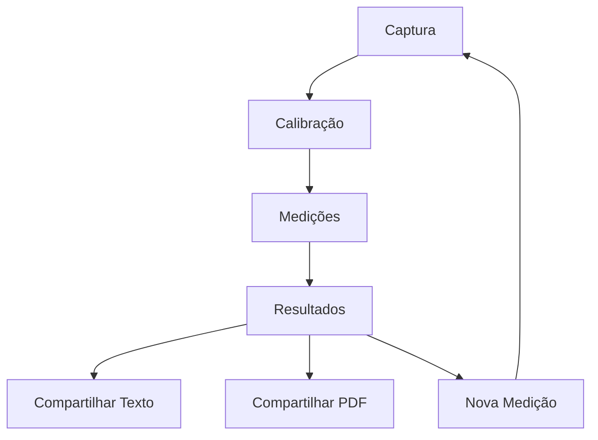

# 👓 App de Medição de Óculos

Um aplicativo móvel desenvolvido em React Native com Expo para medição precisa de parâmetros ópticos necessários para confecção de óculos.

## 📱 Funcionalidades

### 🔍 **Medições Precisas**
- **DP (Distância Pupilar Total)**: Medição da distância entre as pupilas
- **DPN (Distância Pupilar Near)**: Medição individual de cada olho
- **Altura Óptica**: Medição da altura das lentes para cada olho

### 📸 **Captura e Calibração**
- Captura de foto com câmera integrada ou seleção da galeria
- Sistema de calibração usando cartão de referência (85.60mm x 53.98mm)
- Interface com mira (crosshair) para máxima precisão
- Zoom até 5x para medições detalhadas

### 📤 **Compartilhamento**
- **Compartilhamento de Texto**: Via apps nativos (WhatsApp, SMS, etc.)
- **Geração de PDF**: Relatório profissional com design clean
- Dados completos incluindo data, hora e todas as medições

## 🚀 Como Usar

### 1. **Captura da Imagem**
- Tire uma foto ou selecione uma imagem da galeria
- Certifique-se de que há um cartão de referência na imagem

### 2. **Calibração**
- Marque as extremidades esquerda e direita do cartão
- Use zoom e pan para máxima precisão
- O sistema calculará automaticamente a escala

### 3. **Medições**
- Marque os pontos solicitados na sequência:
  - Pupila esquerda
  - Pupila direita  
  - Centro da ponte nasal
  - Base da lente esquerda
  - Base da lente direita

### 4. **Resultados e Compartilhamento**
- Visualize todas as medições calculadas
- Compartilhe via texto ou PDF profissional

## 🛠️ Tecnologias

### **Core**
- **React Native** - Framework principal
- **Expo SDK 53** - Ferramentas de desenvolvimento
- **TypeScript** - Tipagem estática

### **UI/UX**
- **react-native-gesture-handler** - Gestos e interações
- **react-native-reanimated** - Animações fluidas
- **react-native-svg** - Sistema de mira vetorial

### **Câmera e Mídia**
- **expo-camera** - Captura de fotos
- **expo-image-picker** - Seleção de imagens

### **Compartilhamento**
- **expo-print** - Geração de PDF
- **expo-file-system** - Manipulação de arquivos
- **expo-sharing** - Compartilhamento de arquivos
- **Share API** (React Native) - Compartilhamento de texto

## 📋 Pré-requisitos

- **Node.js** 18+ 
- **Expo CLI** ou **Expo Go** app
- **Android Studio** (para Android) ou **Xcode** (para iOS)

## ⚡ Instalação e Execução

### 1. **Clone o repositório**
```bash
git clone https://github.com/Evemarques07/meu-app-otica-expo.git
cd meu-app-otica-expo
```

### 2. **Instale as dependências**
```bash
npm install
```

### 3. **Execute o projeto**
```bash
npx expo start
```

### 4. **Teste no dispositivo**
- **Android**: Use o app Expo Go e escaneie o QR code
- **iOS**: Use o app Expo Go ou Camera para escanear o QR code
- **Simulador**: Pressione `a` (Android) ou `i` (iOS) no terminal

## 📁 Estrutura do Projeto

```
src/
├── components/
│   └── ImageViewer.tsx          # Componente de visualização com zoom/pan
├── screens/
│   ├── CaptureScreen.tsx        # Tela de captura de imagem
│   ├── CalibrationScreen.tsx    # Tela de calibração
│   ├── MeasurementScreen.tsx    # Tela de medições
│   └── ResultsScreen.tsx        # Tela de resultados
├── types/
│   └── index.ts                 # Definições de tipos TypeScript
└── utils/
    ├── measurements.ts          # Cálculos de medições
    ├── permissions.ts           # Gerenciamento de permissões
    └── sharing.ts               # Funcionalidades de compartilhamento
```

## 🎯 Fluxo da Aplicação



## 📊 Precisão das Medições

- **Calibração**: Baseada em cartão padrão de 85.60mm x 53.98mm
- **Resolução**: Cálculos em pixels convertidos para milímetros
- **Interface**: Sistema de mira para posicionamento preciso
- **Zoom**: Até 5x para medições detalhadas

## 🔧 Desenvolvimento

### **Scripts Disponíveis**
```bash
npm start          # Inicia o Expo
npm run android    # Executa no Android
npm run ios        # Executa no iOS
npm run web        # Executa no navegador
```

### **Estrutura de Estados**
- **App.tsx**: Gerencia estado global e navegação
- **Componentes**: Estados locais para interações específicas
- **Tipos**: Tipagem completa com TypeScript

## 🐛 Solução de Problemas

### **Problema de Toque não Detectado**
- ✅ **Solucionado**: Uso de `TouchableWithoutFeedback` para maior confiabilidade

### **Medições Imprecisas**
- ✅ **Solucionado**: Sistema de mira com crosshair SVG e zoom 5x

### **Erro no Compartilhamento**
- ✅ **Solucionado**: Share API nativo para texto, expo-sharing para PDF

## 📄 Licença

Este projeto está sob a licença MIT. Veja o arquivo [LICENSE](LICENSE) para mais detalhes.

## 👨‍💻 Autor

**Evemarques07**
- GitHub: [@Evemarques07](https://github.com/Evemarques07)

## 🤝 Contribuição

1. Faça um fork do projeto
2. Crie uma branch para sua feature (`git checkout -b feature/AmazingFeature`)
3. Commit suas mudanças (`git commit -m 'Add some AmazingFeature'`)
4. Push para a branch (`git push origin feature/AmazingFeature`)
5. Abra um Pull Request

---

**📱 Desenvolvido com React Native + Expo para medições ópticas precisas**
